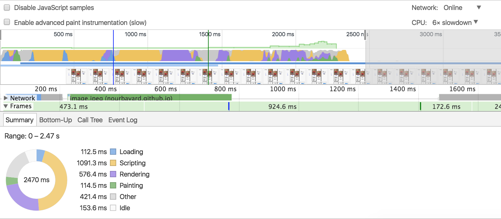

# Browser Technologies
//Robuuste, toegankelijke websites leren bouwen …

## Opdracht 1 - Progressive Enhancement
//Het web is voor iedereen. Leren over Progressive enhancement

### Opdracht 1.1 - Breek het Web
Het Web laten 'breken' door features van het platform bewust uit te zetten. Images, custom fonts, JavaScript, kleur, breedband internet, etc. Allemaal met als doel je te laten beseffen hoeveel je nog niet weet van het Web, erachter komen dat je misschien aannames hebt die niet kloppen, en om je je in te laten leven in de eindgebruiker.

Onderzoek minimaal twee features. Dat betekent uitvogelen wat het voor impact heeft op de sites die je kent en normaal gebruikt. Kies sites in je directe omgeving: van je werkgever, lokale vereniging, de cafetaria om de hoek, en/of eerdere projecten die je zelf gedaan hebt.

Kies 2 features van de 8
- Zoek uit welke problemen ze kunnen veroorzaken (verzamel cijfers, meningen, ervaringen)
- Zoek uit hoe je dit kunt testen (hoe kun je een feature ‘uitzetten’)
- Vind een aantal sites waar dit ook problemen oplevert (uit je directe omgeving)
- Beschrijf hoe je dit kan fiksen
- Maak hierover een presentatie en neem die woensdag mee, dan gaan we de resultaten bespreken
Lezen: [Everyone has JavaScript, right?](https://kryogenix.org/code/browser/everyonehasjs.html) en [I Turned Off JavaScript and it was Glorious](https://www.wired.com/2015/11/i-turned-off-javascript-for-a-whole-week-and-it-was-glorious/)

#### Onderzoek JavaScript en Cookies

##### JavaScript

* Netflix en Youtube doen het helemaal niet meer en je krijgt helemaal geen melding dat je javascript uit staat/kapot is in je browser

* Google Maps kun je ook helemaal niet meer gebruiken, maar je krijgt toch nog een melding te zien.

* Bij Tumblr en Google Docs kun je nog wel de interface zien wanneer je Javascript uit staat, maar nergens op klikken. Daarnaast krijg je ook een melding te zien dat je JS nodig hebt om gebruik te maken van de interface.

* Bij Google kun je nog wel de basisfunctionaliteiten gebruiken (zoeken op website, image, nieuws, etc.) wanneer je JS uit staat.

##### Cookies
* Op de website van Guess (een klerenwinkel), kun je geen bestellingen plaatsen als je je cookies uit hebt staan.
* In het algemeen, als je je cookies uit hebt staan en je van de ene naar de andere website, wordt je niet 'gestalkt' door reclames van de website die je eerder hebt bezocht.

### Opdracht 1.2 - Fork je OBA
Hoe zit het eigenlijk met Progressive Enhancement van je OBA opdracht? Waarschijnlijk kan daar wel het één en ander aan verbeterd worden, dat ding is immers in een week in elkaar gehackt!

Voor deze opdracht ga je toepassen wat je van opdracht 1.1 hebt geleerd.
- Pas Progressive enhancement toe op je OBA Web App.
- Check je OBA Web App op de 8 features uit opdracht 1.1 en verbeter de code waar mogelijk.
- Test  je OBA Web App in het device lab.
- Laat je OBA Web App voorlezen door een screenreader.
- Gebruik onderstaande artikelen om je code te optimaliseren.
[The accessibility mindset](https://24ways.org/2015/the-accessibility-mindset/) en [Accessibility Originates With UX: A BBC iPlayer Case Study](https://www.smashingmagazine.com/2015/02/bbc-iplayer-accessibility-case-study/)

Beoordelingscriteria
- Zet je code op Github
- Schrijf een Readme met:
  - een beschrijving van de problemen die je hebt gevonden
  - beschrijf hoe je de problemen hebt opgelost
  - of hoe je dit zou oplossen (met todo’s) als je genoeg tijd en budget zou hebben

#### Opdracht gemaakt met de CSSTTR repo

##### Javascript
- Kon ik niets voor doen; als de javascript uit staat dan kun je de pagina rustig nog bekijken zonder dat er iets stuk is

##### Cookies
- Er zaten geen cookies op de website, dus wanneer ik de cookies uit had staan werkte de website nog steeds

##### Kleur
- De website is zelf zwart/wit, dus het contrast is prima en ik hoef eigenlijk geen kleuren te veranderen sinds ik gebruik heb gemaakt van kleuren die contrast hebben.

##### localStorage
- Maak ik geen gebruik van.

##### Muis/trackpad
- Wanneer je je muis/trackpad uit zet/het niet meer doet, dan kun je met je tab-key door de website heen browsen.

##### Plaatjes
- Wanneer de plaatjes zijn geblokkeerd, krijg je alsnog een alt-tekst te zien van dat plaatje te zien.

##### CPU throttling
- Website laad snel in, zelfs met 6x CPU slowdown

##### Fonts
- Kon ik niet testen omdat de chrome extention niet werkte.

### Device Lab
Ik heb deze website getest bij het Device Lab 

De resultaten die eruit zijn gekomen is dat bij de apparaten met een IE browser dat de website kapot gaat. Dit komt omdat IE geen grid ondersteund. Daarnaast gaat het rating- en inlog-component in de website kapot bij een aantal apparaten wanneer de browser te klein is. Ik ben erachter gekomen dat dat komt omdat ik er een min-width aan heb gegeven. 
