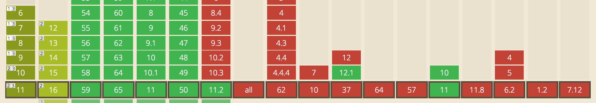
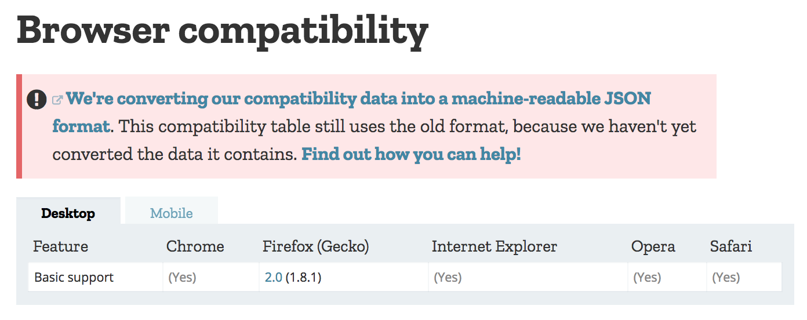
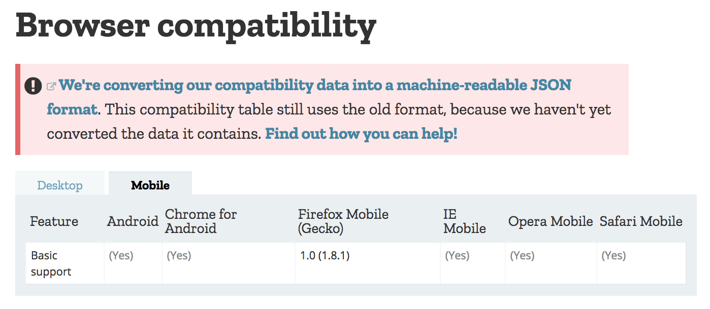
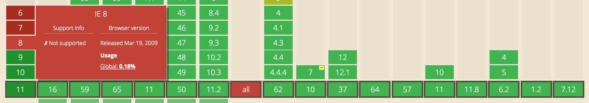
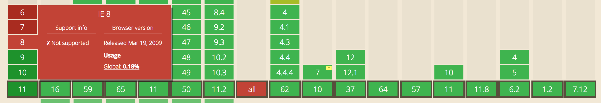
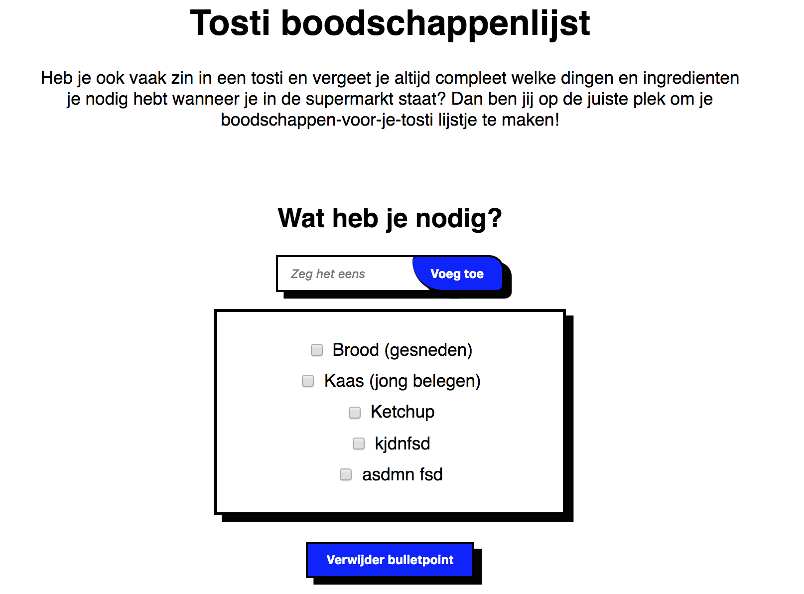

# Browser Technologies - Eindopdracht

## Wat is _Progressive Enhancement_?
> Student kan uitleggen wat Progressive Enhancement en Feature Detectie is en hoe dit toe te passen in Web Development

Progressive Enhancement is wanneer een applicatie wordt opgebouwt vanaf de core functionaliteiten. Wanneer deze zowiezo werken (zonder CSS of JS), worden de layout en extra interactieve elementen om de applicatie _pleasureable_ te maken.

Feature Detection is dat je kijkt naar of een browser een bepaalde functionaliteit ondersteund.


## User case
> "Ik wil boodschappen-om-tostis-te-maken in mijn boodschappenlijstje kunnen gooien" **_!_**

### Core functionaliteiten
De core functionaliteiten van het boodschappen-voor-je-tosti is een overzicht hebben en maken van de ingredienten die nodig zijn voor het maken van tosti's. Daarnaast kun je ook ingredienten van de lijst verwijderen.

### Opbouw van de pagina
De boodschappenlijst heb ik in elkaar gezet met behulp van Node en Express. Op deze manier maak ik gebruik van server-side javascript in plaats van client-side javascript, zodat de core functionaliteiten het nog steeds doen als de javascript in de browser uit staat/het niet doet.

### Features, Browser Technologies en Fallbacks
> - een beschrijving van de feature(s)/Browser Technologies
> - welke browser de feature(s) wel/niet ondersteunen


#### [Drag and Drop (JS)](https://caniuse.com/#search=draggable)

Op dit moment wordt de functie `dataTransfer.items` alleen ondersteund door Chrome en geen van de browsers ondersteund `dropzone`.



Met een `if` statement heb ik een fallback  gecreëerd. Wanneer de browser de `classList` en `classList` en `dataTransfer.items` ondersteund, dan voert hij de code van de Drag & Drop uit.

```
if (document.documentElement.classList && dataTransfer.items) {
  // some code here
}

```


#### [Draggable (CSS)](https://developer.mozilla.org/en-US/docs/Web/HTML/Global_attributes/draggable)

Volgens MDN wordt het `[draggable=true]` attribuut ondersteunt door alle browsers op desktop en op mobiel.

```    
  [draggable=true] {
      -khtml-user-select: none;
      user-select: none;
      /* Required to make elements draggable in old WebKit */
      -khtml-user-drag: element;
      -webkit-user-drag: element;
    }
```




#### [Box-shadow (CSS)](https://caniuse.com/#search=box-shadow)
De `box-shadow` wordt gesupport in bijna alle browsers. De enige browsers die deze CSS property niet ondersteunen zijn IE6/7/8 en Opera Mini.



Met `@support` heb ik een fallback hiervoor geschreven waardoor de gebruiker op IE een border om deze elementen krijgt te zien in plaats van de `box-shadow`.

```
input[type=text],
button {
  /* some code here */
  border: 2px solid black;
}

ul {
  /* some code here */
  border: 3px solid black;
}

@supports (box-shadow: 7px 6px rgba(0, 0, 0, 0.99)) {

  input[type=text],
  button {
    box-shadow: 7px 6px rgba(0, 0, 0, 0.99);
  }

  ul {
    box-shadow: 7px 6px rgba(0, 0, 0, 0.99);
  }
}
```


#### [Border-radius (CSS)](https://caniuse.com/#search=border-radius)
Ook de `border-radius` wordt gesupport in bijna alle browsers en zijn de enige browsers die deze CSS property niet ondersteunen IE6/7/8 en Opera Mini.



Ook voor deze CSS property heb ik een fallback geschreven met `@support`. Wanneer de browser de `border-radius` niet ondersteunt, dan hebben de elementen de default styling.

```
@supports (border-radius: 10px 30px 15px 60px) {
  div>button {
    border-radius: 10px 30px 15px 60px;
  }
}
```

### Accessibilities
> - Een beschrijving van de accessibility issues die zijn onderzocht

Keyboard & Screenreader

- De core functionaliteiten zijn volledig bestuurbaar met een keyboard (tab, spatie, enter).
- Alle ```input``` attributen hebben een bijbehorend label waarin staat waar de input voor is.
- De kleurcontrasten zijn zwart/wit en wit/blauw. Om er zeker van te zijn dat de tekst nog steeds te lezen is door met de contrasten heb ik [contrastchecker](https://contrastchecker.com) gebruikt.


### Pattern Primer
> De demo is opgebouwd in 3 lagen, volgens het principe van Progressive Enhancement
// link naar schets in pattern Primer
Beoordelingscriteria

### User Experience
> - De user experience van de demo is goed
> - de leesbaarheidsregels zijn toegepast, contrast en kleuren kloppen
> - het heeft een gebruiksvriendelijke interface, met gebruikmaking van affordance en feedback op de interactieve elementen

- Zoals eerder vermeld, heb ik gebruik gemaakt van kleurcontrasten die ik heb getest via [contrastchecker](https://contrastchecker.com). (zie [Accessibilities](#accessibilities))
- Op de ```<li>``` elementen waarin de ingredienten in zitten, zit beide een affordance en feedback
  - Affordance: wanneer je met je muis op de lijst elementen hovered, zie je de default cursor veranderen naar een move cursor. Hierdoor ziet de gebruiker dat hij de elementen kan verplaatsen.
  - Feedback: wanneer de gebruiker een van de ```<li>``` elementen verplaatst, dan wordt dat element deels doorzichtig en komt er een randje om het ```li``` element waarover gehovered wordt.
  

### Screenshot



### TL;DR

Ik heb een vette boodschappenlijst waarin de core  functionaliteiten (het toevoegen van ingedrienten aan de lijst + overzicht hebben) server-side gerendered zijn, zodat wanneer de JS het niet doet/kapot is men de boodschappenlijst nog steeds kan gebruiken. Daarnaast ziet hij er oke uit EN is die volledig accessible. Plus als extra feature (_Drag and Drop_, die client-side is) kan men de lijst herschikken. Lijp. 🎉
